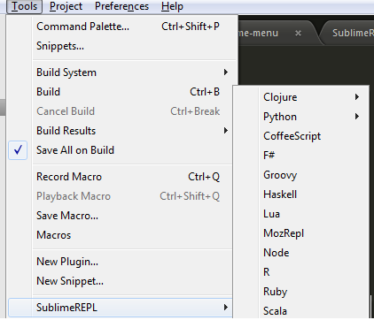
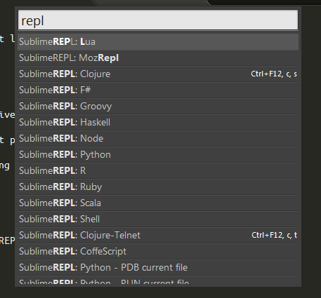

.. SublimeREPL documentation master file, created by
   sphinx-quickstart on Sun Feb 26 16:38:41 2012.
   You can adapt this file completely to your liking, but it should at least
   contain the root `toctree` directive.

SublimeREPL
===========

SublimeREPL is a plugin for Sublime Text 2 that lets tou run interactive 
interpreters of several languages within a normal tab. It also allows 
connecting to a remote interpreter (e.g. Clojure/Lein) though a telnet port. 

SublimeREPL has a built-in support for command history and transferring code from
open buffers to the interpreters for evaluation. 

Installation
------------

Download `Package Control`__, select Install Package and pick SublimeREPL from the list of 
available packages. 

__  http://wbond.net/sublime_packages/package_control

Quick Start
-----------

SublimeREPL adds itself as a submenu in Tools. You can choose any one of the preconfigured  REPLs and 
if it's available in your SYSTEM PATH [#]_, it will be launched immediately. 

Second and more user friendly way to launch any given REPL is through Command Palette. Bring up Command Palette and type "repl". You will be presented
with all preconfigured REPLs. Running REPL through Command Palette has exactly the same result as picking it from *Tools > SublimeREPL* menu.

.. [#] One of the most frequently reported errors is SublimeREPL not being able to find interpreter executable, even if it's visible in your shell. There are several way to fix this problem that we'll discuss in FAQ. 

Keyboard Shortcuts
------------------

Language specific information 
-----------------------------

Configuration
-------------

Frequently Asked Questions
--------------------------

.. toctree::
   :maxdepth: 2

Indices and tables
==================

* :ref:`genindex`
* :ref:`modindex`
* :ref:`search`

